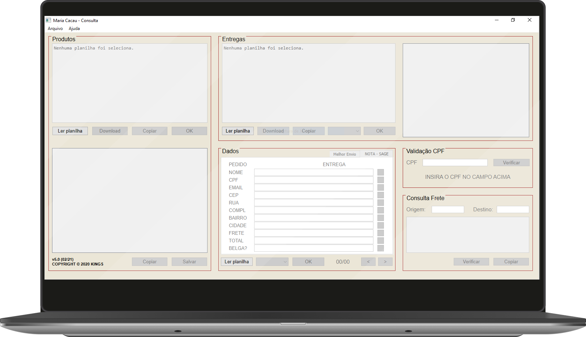
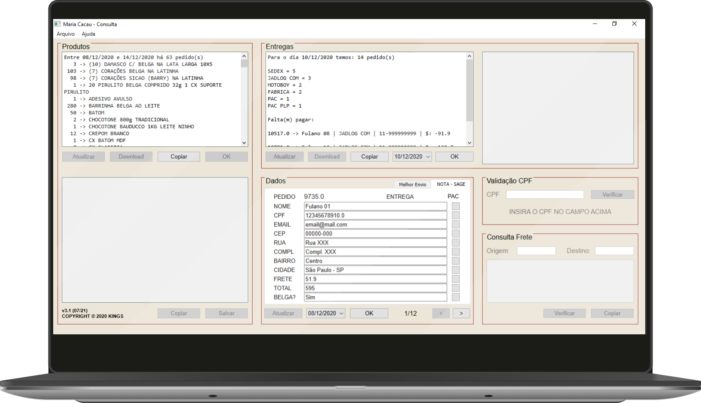

# Maria Cacau - Contagem

[](#)

[](https://www.python.org/downloads/)
[](https://github.com/Gui25Reis/Maria-Cacau-Contagem/blob/main/LICENSE)


<p align="center">
    
</p>

App desktop para gestão de pedidos e entregas da Maria Cacau. Lê diretamente a planilha Google Sheets e gera resumos de:
- **Produtos**: contagem de itens por período
- **Entregas**: resumo diário com inadimplências
- **Nota Fiscal**: dados para emissão SAGE e Melhor Envio

</br>

- [Plataforma e Requisitos](#plataforma-e-requisitos)
- [Como rodar](#como-rodar)
- [Demo](#demo)
- [Autor](#autor)
- [Empresa](#empresa)

## Plataforma e Requisitos

O projeto roda em macOS e Windows.

| **Arquivo** | **Descrição** |
|---|---|
| [`.python-version`](.python-version) | Versão do Python |
| [`pyproject.toml`](pyproject.toml) | Dependências Python |
| [`Brewfile`](Brewfile) | Dependências do sistema (macOS) |

## Como rodar

> [!NOTE]
> Se estiver no VS Code, basta mandar rodar o projeto — o `__main__.py` será [acionado automaticamente](.vscode/launch.json).

**macOS:**

```bash
# Rodar o setup (instala direnv, cria o venv e instala as dependências)
./scripts/build.sh

# Rodar o app
python -m maria_cacau
```

> Após o setup, o [direnv](https://direnv.net) ativa o venv automaticamente ao entrar na pasta do projeto.

**Windows:**

```bat
# Rodar o setup (cria o venv e instala as dependências)
scripts\build.bat

# Ativar o ambiente virtual
venv\Scripts\activate.bat

# Rodar o app
python -m maria_cacau
```

## Gerar executável

> [!NOTE]
> É necessário ter rodado o `build` antes para ter o venv configurado.

**macOS:**

```bash
## Mac
./scripts/package.sh

## Windows
scripts\package.bat

```
O executável fica em `dist/MC - Análise.app`.

## Demo

<p align="center">
    
</p>
<br>
<p align="center">
    
</p>

## Autor

<table>
    <tr>
        <td align="center">
            <a href="https://github.com/Gui25Reis">
                <br>
                <sub>
                    <b>Gui Reis</b>
                </sub>
            </a>
        </td>
    </tr>
</table>

## Empresa

<table>
    <tr>
        <td colspan="3" align="center">
            <a href="https://www.mariacacau.com.br/">
                <br>
            </a>
        </td>
    </tr>
    <tr>
        <td align="center">
            <a href="https://www.mariacacau.com.br/">site</a>
        </td>
        <td>
            <a href="https://www.instagram.com/mariacacau_oficial/">instagram</a>
        </td>
        <td>
            <a href="https://linktr.ee/mariacacau_oficial">orçamento</a>
        </td>
    </tr>
</table>
