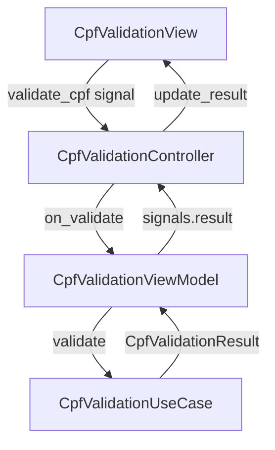
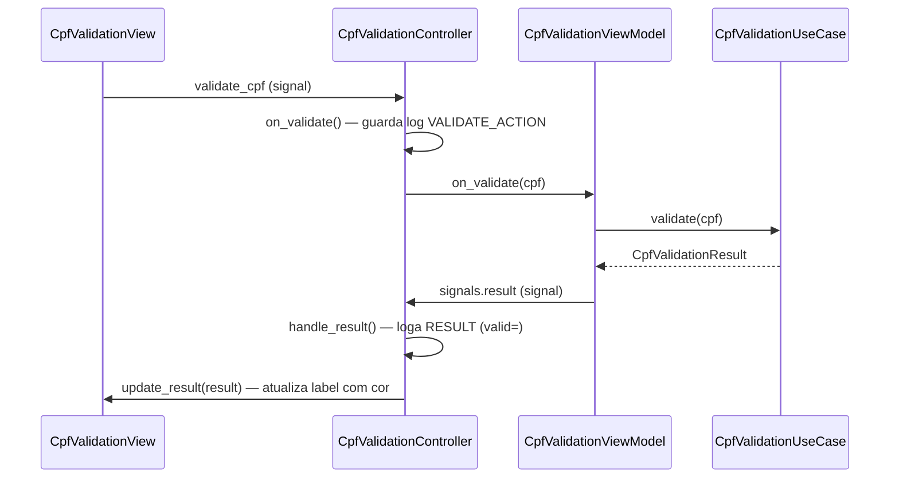

# CPF Validation

Valida matematicamente um CPF digitado pelo usuário (algoritmo dos dois dígitos verificadores da Receita Federal) e exibe feedback visual imediato com cor diferenciada para válido/inválido.

## Arquitetura

> Sem camada `data/` — a validação é local, sem chamada de rede ou backend.

## Responsabilidade das classes

| Classe | Camada | Responsabilidade |
|---|---|---|
| `CpfValidationView` | presentation | Renderiza UI, expõe signal `validate_cpf`, exibe resultado com cor |
| `CpfValidationController` | presentation | Conecta signal da view ao ViewModel, recebe resultado e atualiza a view, loga observabilidade |
| `CpfValidationViewModel` | presentation | Chama o UseCase e emite o resultado via signal |
| `CpfValidationUseCase` | domain | Encapsula o algoritmo de validação, retorna `CpfValidationResult` |
| `CpfValidationResult` | domain | Dataclass com `cpf: str` e `is_valid: bool` |
| `CpfValidationSignals` | domain | Canal de comunicação entre ViewModel e Controller via `pyqtSignal` |
| `FeatureEvents` | domain | Enum de eventos de observabilidade da feature |

## Fluxo principal

## Observabilidade

| Evento | Quando |
|---|---|
| `FeatureEvents.VALIDATE_ACTION` | Botão "Verificar" clicado (ou Enter no campo) |
| `FeatureEvents.RESULT` | Resultado recebido — extra: `valid=True/False` |
