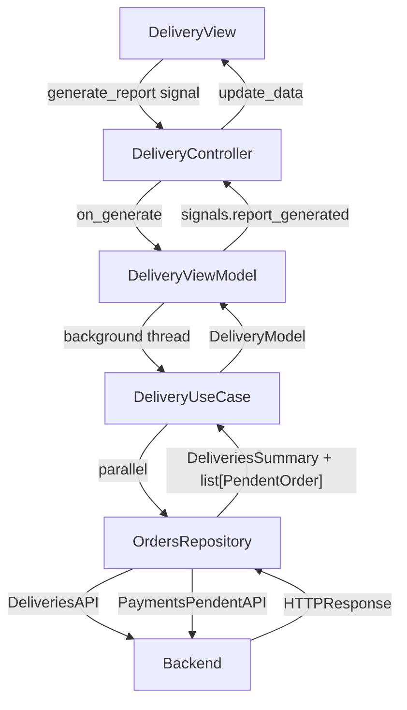
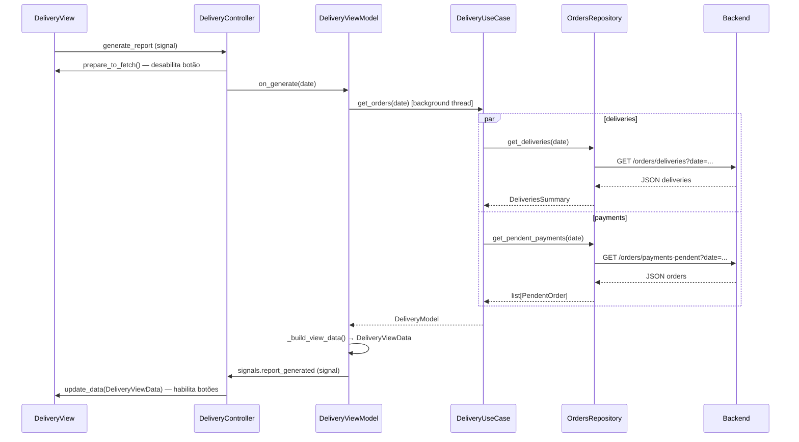
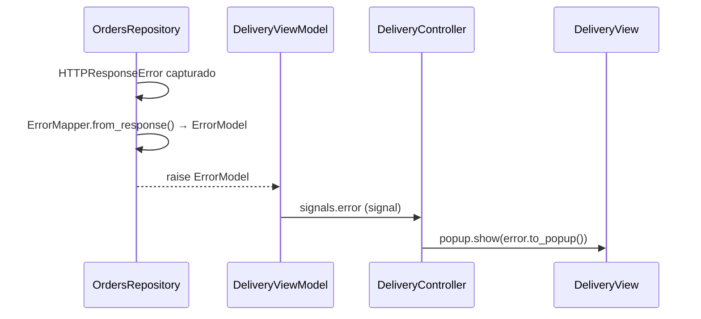

# Delivery

Exibe o resumo de entregas do dia selecionado: total por modalidade (gráfico de pizza) e lista de pedidos com pagamento pendente.

## Arquitetura

## Responsabilidade das classes

| Classe | Camada | Responsabilidade |
|---|---|---|
| `DeliveryView` | presentation | Renderiza UI, expõe signals de domínio, gerencia estado dos botões |
| `DeliveryController` | presentation | Conecta signals da view ao ViewModel e respostas do domínio à view |
| `DeliveryViewModel` | presentation | Executa UseCase em background thread, monta `DeliveryViewData`, emite via signals |
| `DeliveryUseCase` | domain | Orquestra chamadas paralelas ao repository, monta `DeliveryModel` |
| `OrdersRepository` | data | Chama as APIs, captura erros HTTP e converte para `ErrorModel` via `ErrorMapper` |
| `DeliveriesAPI` | data | Define path e parâmetros do endpoint `GET /orders/deliveries` |
| `PaymentsPendentAPI` | data | Define path e parâmetros do endpoint `GET /orders/payments-pendent` |
| `DeliveriesMapper` | data | Converte `HTTPResponse → DeliveriesSummary` |
| `PaymentsMapper` | data | Converte `HTTPResponse → list[PendentOrder]` |
| `ErrorMapper` | data | Converte `HTTPResponseError → ErrorModel` lendo o JSON do backend |

## Fluxo principal

## Fluxo de erro

