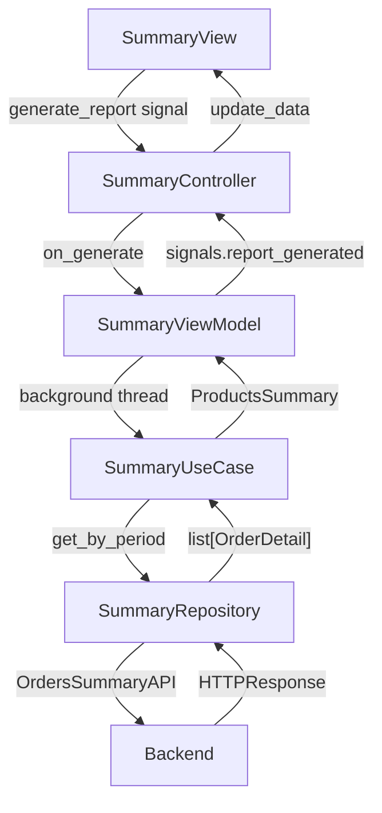
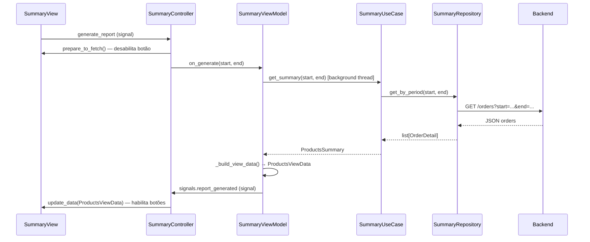
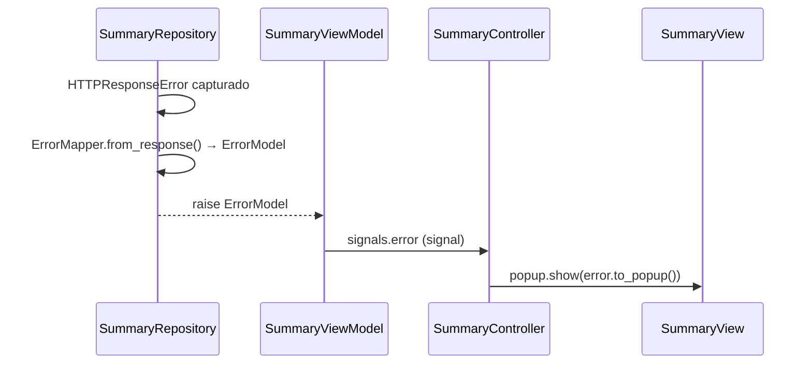

# Summary

Exibe o resumo de produtos por período: contagem de itens vendidos (texto + gráfico de barras ou pizza) para um intervalo de datas selecionado pelo usuário.

## Arquitetura

## Responsabilidade das classes

| Classe | Camada | Responsabilidade |
|---|---|---|
| `SummaryView` | presentation | Renderiza UI, expõe signals de domínio, gerencia estado dos botões e do gráfico |
| `SummaryController` | presentation | Conecta signals da view ao ViewModel e respostas do domínio à view |
| `SummaryViewModel` | presentation | Executa UseCase em background thread, monta `ProductsViewData`, emite via signals |
| `SummaryUseCase` | domain | Agrega `list[OrderDetail]` em `ProductsSummary` por dia e global |
| `SummaryRepository` | data | Chama a API, captura erros HTTP e converte para `ErrorModel` via `ErrorMapper` |
| `OrdersSummaryAPI` | data | Define path e parâmetros do endpoint `GET /orders` |
| `OrdersSummaryMapper` | data | Converte `HTTPResponse → list[OrderDetail]` |
| `ErrorMapper` | data | Converte `HTTPResponseError → ErrorModel` lendo o JSON do backend |

## Fluxo principal

## Fluxo de erro

